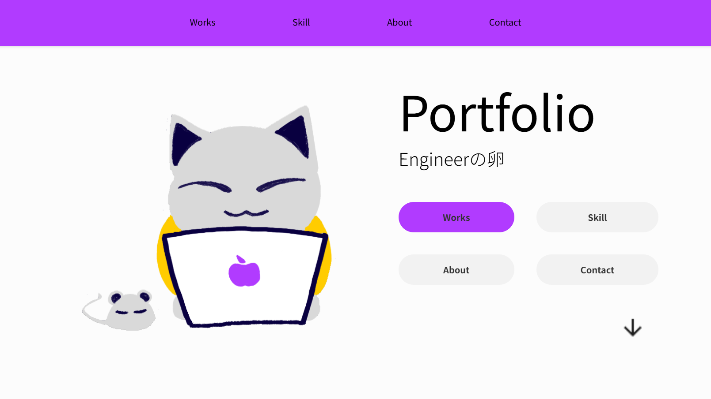
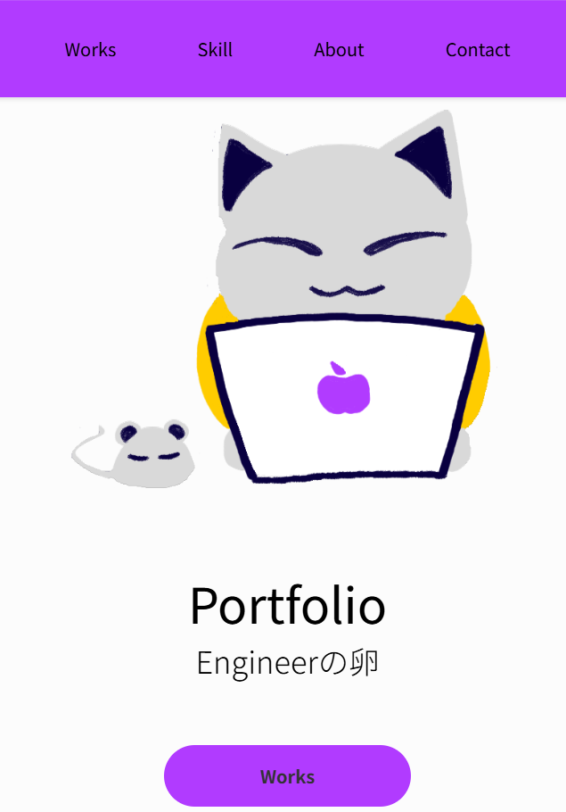

# 🖼 ポートフォリオサイト
このプロジェクトは2025年7月に作成しました。

就職活動のために作成したWeb ポートフォリオです。  
自分の制作実績、スキル、Gmailなどをまとめています。

※個人情報保護のため、READMEやポートフォリオ内の氏名・学校名などは一部フェイクを使用しています。  
※本来の情報は履歴書・職務経歴書にてご確認ください。

---

## 🔗 デモ

- **サイトURL**  
  [https://yourname-portfolio.vercel.app](https://yourname-portfolio.vercel.app)

- **スクリーンショット**  
  
  

- **動画デモ** 

  []

  👆クリックで動画（YouTube）を再生できます。

---

## 🛠 使用技術

　　

---

## 💡 工夫した点

- レスポンシブ対応（スマホ、タブレット、パソコン）
- アニメーションなどUXに配慮した設計
- 制作物の内容を直感的に把握できる動画やスクリーンショット

---

## 🚀 ポートフォリオサイトのセットアップ方法

このポートフォリオは静的なHTML＋CSSで作成されています。  
ローカルで動作確認したい場合は、`index.html` をブラウザで開くだけでOKです。

---

## ⚛️ Reactアプリ（動画埋め込み）について

Reactアプリは別リポジトリで管理しています。  
セットアップや動作方法は以下のリンクをご参照ください。

[Reactアプリ リポジトリ(タスク管理)はこちら](https://github.com/kanikamaster/App-1)

[Reactアプリ リポジトリ(来店数カウンター)はこちら](https://github.com/kanikamaster/App-2)

---

## 📌 作者プロフィール

- 名前：A.A
- 学校：K大学 情報学部
- 興味：Webアプリ開発 / UIデザイン / チーム開発
- GitHub：[github.com/kanikamaster](https://github.com/kanikamaster)

---

## 📬 お問い合わせフォーム
  👉[こちらからどうぞ](https://forms.gle/r6J56MgW3LNqF35m8)
